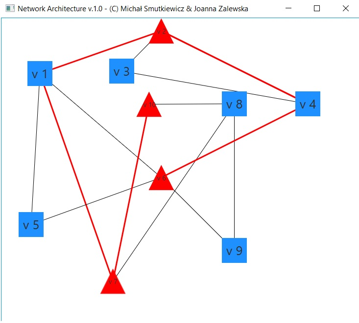

 # Network Architecture
 Program w języku Java z GUI JavaFX wczytujący z pliku strukturę grafu (sieci) i wykonujący na nim algorytmy: najkrótszej ścieżki, najlżejszego drzewa rozpinającego, Floyda.

 Celem projektu jest zapoznanie się z podstawowymi problemami w projektowaniu sieci telekomunikacyjnych oraz implementacja i przebadanie podstawowych algorytmów służących do wyznaczania drzew i ścieżek w sieciach. Realizacja złożonego algorytmu, opartego na algorytmie Dijkstry, służącego do optymalizacji sieci.

 

    
 

 # TODO
 * ~~Zacząć~~ (Done!)
 * ~~Layout aplikacji~~ (Done!)
 * ~~Kolorowanie link'ów~~ (Done!)
 * ~~Implementacja algorytmów~~ (Done!)
 * ~~Dijkstra (SCIEZKA) z kolorowaniem grafu~~ (Done!)
 * ~~Najlżejsze drzewo rozpinające (MST) z kolorowaniem grafu~~ (Done!)
 * ~~Floyd (FLOYD) z kolorowaniem grafu~~
 * Różnokolorowe pojedyncze krawędzie we Floydzie
